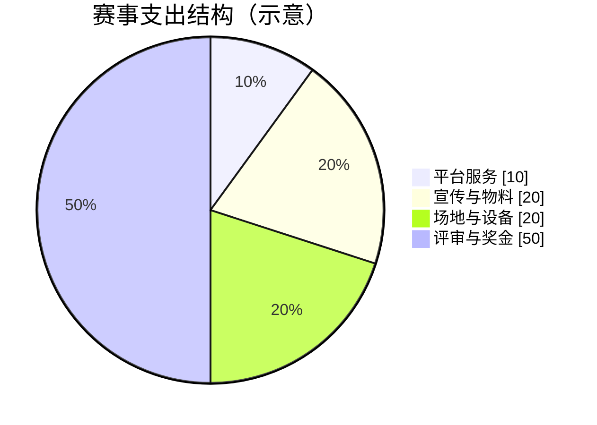
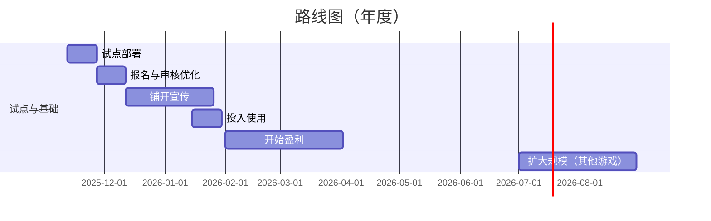

# 创业计划书（第五人格赛事统一管理平台）

## 目录
- 1 封面页
- 2 执行摘要
  - 2.1 项目概述
  - 2.2 核心创新点
  - 2.3 市场机会
  - 2.4 财务预测摘要
- 3 项目介绍
  - 3.1 产品/服务描述
  - 3.2 技术原理
  - 3.3 知识产权情况
  - 3.4 当前开发阶段
- 4 市场分析
  - 4.1 目标市场规模（针对《第五人格》）
  - 4.2 客户画像
  - 4.3 竞争分析（SWOT）
  - 4.4 市场趋势
  - 4.5 市场数据图（示意）
- 5 商业模式
  - 5.1 收入来源（细化）
  - 5.2 定价策略
  - 5.3 销售渠道
- 6 运营计划
  - 6.1 组织架构
  - 6.2 核心团队成员简历
  - 6.3 研发/生产计划（Gantt示意）
  - 6.4 营销推广策略
- 7 财务计划
  - 7.1 3年财务预测表（示例）
  - 7.2 资金需求与使用计划
- 8 风险分析
  - 8.1 潜在风险识别
  - 8.2 应对策略
  - 8.3 应急预案
- 9 附录

---

## 1 封面页
- 项目名称：第五人格赛事统一管理平台
- 团队名称：《TODO》
- 参赛学校：西南民族大学
- 日期：2025-11-12

## 2 执行摘要
### 2.1 项目概述（200-300字）
本平台面向高校《第五人格》赛事的统一管理，解决主办方在赛程编排、报名审核、规则执行（如地图池、BAN/PICK、阵营轮换）、裁判打分、战报与数据归档等环节的痛点。系统提供标准化报名数据结构、隐私合规的联系方式展示（QQ号分级显示与审计）、一键导出与可视化看板，并内置通知积分机制用于审核通过/赛程更新触达。平台定位“低门槛部署 + 高赛规适配 + 强合规审计”，首年以社团联赛和校际友谊赛为切入，形成高校赛事数字化样板，3年内在区域内复制并打通赞助与直播生态。

### 2.2 核心创新点
- 赛规引擎：针对《第五人格》提供地图池、角色BAN/PICK、阵营轮换、局分判定等可配置规则模板。
- 权限可编排与审计：赛事创建者/管理员控制敏感信息访问，查看与复制均留痕；默认遮蔽、二次确认。
- 数据结构化与导出：报名、队员、赛程、比分、技术统计统一模型，支持Excel/CSV导出与图表展示。
- 低成本触达：邮件积分控制通知成本，结合节点触发（审核、赛程变更、结果公示）。

### 2.3 市场机会
- 《第五人格》玩家与社团活跃度高，赛事组织需求旺盛但流程分散、规范性弱。
- 高校数字化治理对合规与审计要求提升，标准化平台具备进入门槛与信用背书。

### 2.4 财务预测摘要
- 收入来源涵盖赛事广告、SaaS订阅、通知积分包、定制赛规与数据看板、赞助资源整合；第3年达盈亏平衡，详见“7 财务计划”。

## 3 项目介绍
### 3.1 产品/服务描述
- 赛事管理：赛事创建、报名配置（名额、时间窗口）、战队报名审核、赛程编排（小组循环/淘汰）、裁判端打分。
- 赛规模板：
  - 地图池管理与禁用列表；
  - 角色BAN/PICK流程（求生者/监管者轮次与时限）；
  - 阵营轮换（监管者与求生者轮换规则）；
  - 局分算法（通关数、击倒/牵绳、救援次数、开门时间等指标权重可配）；
  - 违规判定与重赛机制（掉线、超时、替补上场规则）。
- 数据与战报：赛后自动生成战报，统计追击时长、密码机进度、救援次数、牵制时长等关键数据；支持导出。
- 队伍协作：战队注册、队员名单与角色特长、QQ与联系方式，隐私分级显示与复制审计。
- 通知系统：审核通过、赛程更新、结果公示自动触发邮件通知，积分扣费可视化。
- 看板：赛事报名概览、对阵视图、赛果与MVP统计、裁判工作量统计。

### 3.2 技术原理
- 架构：ASP.NET Core + EF Core + SQLite（或可切换到 PostgreSQL），前端 Vue 3 + Vuetify；REST API；后续可引入 SignalR 实时比分。
- 权限与审计：基于角色/策略的授权，敏感字段访问按事件审计（view/copy），日志结构化输出便于检索。
- 导出与兼容：CSV导出采用UTF-8 BOM保证Excel中文识别；复制支持 Clipboard API 与 execCommand 回退。
- 安全：敏感信息默认遮蔽、二次确认、最小权限原则、服务器端强校验。

### 3.3 知识产权情况
- 可申请软件著作权；赛事规则模板与数据结构说明归档；战报自动化生成与审计策略可形成技术文档。

### 3.4 当前开发阶段
- 已完成核心流程（报名、审核、赛程、导出、审计）；下一阶段上线赛规引擎与实时比分模块，正在灰度测试。

## 4 市场分析
### 4.1 目标市场规模（针对《第五人格》）
- 《第五人格》玩家基数大，社团活跃，全年赛事活动频次高（校内杯、社团联赛、校际友谊赛、重创赛）。
- 第五人格官方重视赛事组织，形成了一定的品牌影响力。
- 以每校每年10-20场相关活动估算，首年覆盖10-20所高校，年增长以30%-50%为目标。
- 《第五人格》已成为2026亚运会比赛项目

### 4.2 客户画像
- 主办方：社团联合会、电竞社、院系学生会、创新创业学院；需求集中在流程统一与赛规落地。
- 参赛队伍：校内战队与兴趣小组；关注报名便捷、规则透明、赛程明确与战报留存。

### 4.3 竞争分析（SWOT）
- 优势（S）：深度适配《第五人格》赛规；合规审计；低成本通知；数据看板与导出。
- 劣势（W）：品牌初期影响力有限；部分赛事接入需要谈判周期。
- 机会（O）：高校数字化与合规要求提升；联赛标准化需求上升。
- 威胁（T）：通用赛事平台横向扩展；自建系统替代；IP赛事政策变动。

### 4.4 市场趋势
- 电竞专业化、规范化；数据驱动的评估与复盘成为主流。
- 隐私与合规治理渗透赛事流程；赞助与直播生态与校园互动增强。

### 4.5 市场数据图（示意）

我们会努力提高平台服务的成本效率，同时保持低通知成本，以满足用户的需求。

## 5 商业模式
### 5.1 收入来源（细化）
- 校园赛事SaaS订阅（按校/年或按赛事数计费）。
- 通知增值（邮件积分包，后续可拓展短信/IM整合）。
- 赞助与曝光资源整合（赞助商位、战报页品牌露出）。
- 定制开发与系统对接。

### 5.2 定价策略
- 邮件积分包：10元，包含100积分；30元，包含310积分。
- 广告位：50元/月，提供广告位展示与点击统计。
- 按需增值包：通知积分(灵活计价)、定制报表、培训与运维。

### 5.3 销售渠道
- 直销：面向电竞社、个人主办方。
- 合作：与主办方。

## 6 运营计划
### 6.1 组织架构
- 产品与赛规：负责赛规模板、裁判工具与体验优化。
- 技术研发：后端、前端、测试与DevOps。
- 运营与客户成功：试点对接、培训交付、支持与反馈闭环。

### 6.2 核心团队成员简历
- CTO：大型Web系统经验，关注可靠性与数据治理；研究实时比分与反作弊。
- 赛规负责人：熟悉《第五人格》赛事规则与裁判流程，制定模板与培训手册。

### 6.3 研发/生产计划（Gantt示意）

### 6.4 营销推广策略
- 校园路演与试点共创；与社团联合会签订合作框架；举办裁判与赛务培训。
- 内容运营：战报模板、MVP榜、数据可视化分享；赞助联合曝光。

## 7 财务计划
### 7.1 3年财务预测表（示例）
| 指标 | Y1 | Y2 | Y3 |
|---|---:|---:|---:|
| 收入（元） | 1500 | 6500 | 11300 |
| 其中-订阅 | 300 | 1000 | 3000 |
| 其中-通知 | 200 | 1500 | 2300 |
| 其中-定制/赞助 | 1000 | 4000 | 6000 |
| 净利润（元） | 1200 | 5600 | 8900 |

### 7.2 资金需求与使用计划
- 种子轮：用于赛规引擎、看板与多校试点；
- 使用结构：研发40%、市场30%、运维20%、管理10%。

## 8 风险分析
### 8.1 潜在风险识别
- 渠道与校内采购周期较长；预算限制；竞品进入或自建系统替代。
- 赛规争议与裁判尺度不一致；技术掉线与超时导致重赛频发。
- 合规与隐私风险（联系方式与队伍数据处理）。

### 8.2 应对策略
- 建立试点样板与标准化方案包；价格分层降低门槛；赞助联合分担成本。
- 赛规模板公开透明、裁判培训与规则宣导；技术演练与应急预案。
- 敏感信息分级显示、二次确认、全程审计与最小权限原则。

### 8.3 应急预案
- 预算收紧：提升免费功能覆盖、引导增值包转化；加强校内合作资源置换。
- 技术事件：灰度发布、快速回滚、演练SLA、备用通道通知。

## 9 附录
- 赛事赛规模板（《第五人格》）：地图池、BAN/PICK、阵营轮换、局分算法示例。
- 裁判打分与战报样例：关键指标与统计口径说明。
- 专利证明（占位）：附录/专利证明/
- 合作协议（占位）：附录/合作协议/
- 用户调研数据（占位）：附录/用户调研数据/
- 产品原型图（占位）：附录/产品原型图/

---
